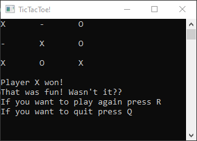

# TicTacToe
A simple game everyone knows.

# Description
You know the rules.

# Tools
The following development tools were used:
- C#
- MS Visual Studio

# How to run the project
Just run the [.exe](TicTacToe/bin/Debug/TicTacToe.exe) file :)

# How to use the project
Play this game on computer, not on paper, save the environment!

# How to improve the project
Write an AI, that plays instead of your friend.

# Authors
- https://github.com/just-a-Programmer1

# License
[GNU General Public License v3.0](LICENSE)
